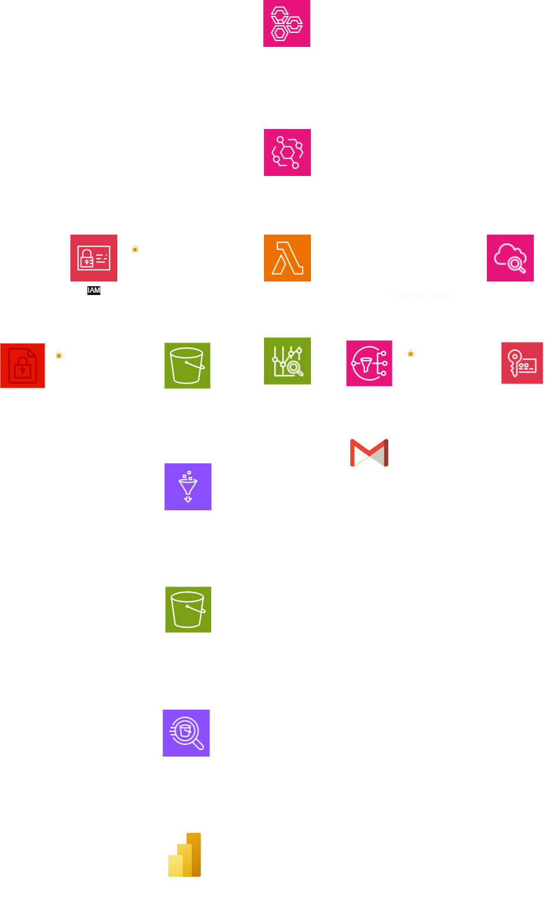
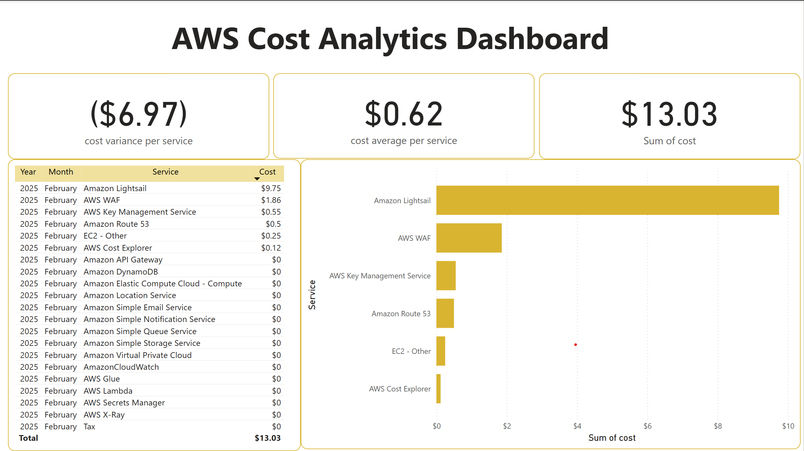
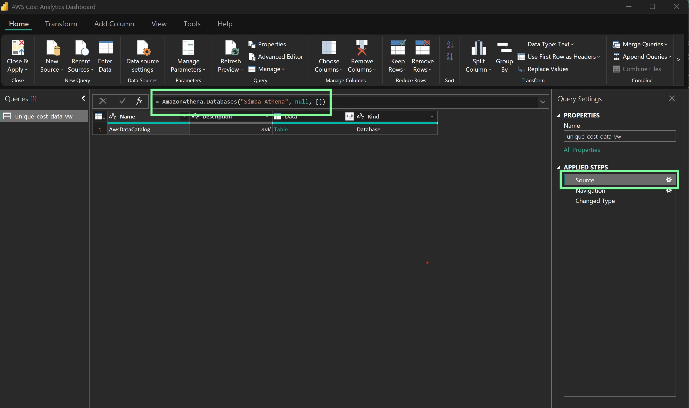

# Cloud Cost Optimization Dashboard
Automate AWS cost tracking, monitor expenses, and receive alerts for cost spikes.

## Table of Contents
1. Introduction
2. Features
3. Architecture Overview
4. Technologies Used
5. Prerequisites
6. Setup & Deployment
7. Usage
8. Future Enhancements

## Introduction
The **Cloud Cost Optimization Dashboard** automates the tracking and monitoring of AWS cloud expenses. It helps prevent cost overruns by providing real-time cost insights and alerting users about potential spikes.

## Features
- **Automated Cost Tracking**: Uses AWS Lambda to fetch and process AWS cost data.
- **Real-Time Monitoring**: Integrates AWS CloudWatch for tracking and logging Lambda executions.
- **Cost Alerts**: Sends notifications via AWS SNS when cost anomalies are detected.
- **Data Transformation & Storage**: Utilizes AWS Glue to convert JSON data to CSV and store it in S3.
- **Visualization**: Uses AWS Athena to query cost data and Power BI to visualize insights.

## Architecture Overview
1. **AWS Well-Architected Tool** evaluates cloud architecture best practices.
2. **EventBridge** triggers **AWS Lambda** to fetch cost data.
3. **IAM Roles & Policys** enforce least privilege access for security.
4. **AWS Lambda** retrieves cost data and:
   - Stores it in **S3** (encrypted with SSE-S3/KMS).
   - Sends alerts via **SNS** (encrypted with KMS) to **Gmail**.
   - Logs execution details in **CloudWatch**.
5. **AWS Glue** transforms JSON data into CSV format and stores it back in **S3**.
6. **AWS Athena** queries cost data from S3.
7. **Power BI** visualizes the cost data from Athena.

## Architecture Diagram



## Technologies Used
- **AWS Lambda** - Fetches cost data.
- **AWS Cost Explorer API** - Retrieves AWS cost and usage details.
- **AWS CloudWatch** - Logs Lambda execution and detects anomalies.
- **AWS SNS** - Sends email alerts.
- **AWS Glue** - Transforms data from JSON to CSV.
- **AWS Athena** - Queries cost data from S3.
- **Power BI** - Visualizes cost insights.
- **IAM & KMS** - Secures data access and encryption.

## Prerequisites
- **AWS Account** with Cost Explorer enabled.
- **AWS CLI** installed and configured.
- **Terraform** installed.
- **Email** to receive cost alerts.
- **Power BI** installed.
- **Athena ODBC driver** installed and configured.

## Setup & Deployment
1. **Clone the Repository**
   ```sh
   git clone https://github.com/Heero04/cloud-cost-dashboard.git
   cd cloud-cost-dashboard
   ```
2. **Initialize and Deploy Infrastructure**
   ```sh
   terraform init
   terraform apply -auto-approve
   ```
3. **Confirm SNS Subscription**
   - Check your email for an SNS confirmation and accept it to start receiving alerts.

## Usage
- The **Lambda function** runs weekly to fetch cost data.
- **CloudWatch** logs execution and detects cost spikes.
- **SNS** sends an email alert if a cost anomaly is found.
- **AWS Glue** processes data for structured storage.
- **Athena** allows querying cost data.
- **Power BI** visualizes cost trends for insights.

## Future Enhancements
- **Anomaly Detection**: Implement ML-based cost prediction.
- **Automated Cost Optimization**: Identify and shut down underutilized resources.
- **Notification System Expansion**: Expand notification to diffrent platforms.
- **Athena CTAS**: Replace Glue with an Athena CTAS query.

## Dashboard Screenshots

### Cost Overview


### Data Source


This project ensures cost-efficient cloud management by providing visibility, automation, and alerting for AWS expenses.


