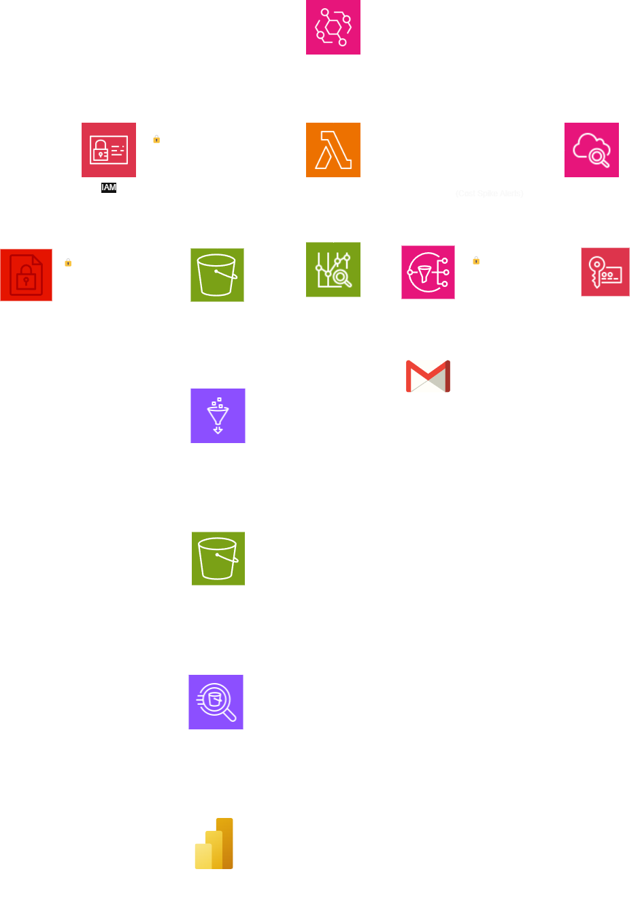

# Cloud Cost Optimization Dashboard
Automate AWS cost tracking, monitor expenses, and receive alerts for cost spikes.

## Table of Contents
1. Introduction
2. Features
3. Architecture Diagram
4. Technologies Used
5. Prerequisites
6. Setup & Deployment
7. Usage
8. Future Enhancements
9. Contributing
10. License

## Introduction
The Cloud Cost Optimization Dashboard is designed to help AWS users automate the tracking of their cloud expenses. It provides real-time monitoring and alerts for unexpected cost spikes, ensuring better budget management and cost control.

## Features
- Automated Cost Tracking: Utilizes AWS Lambda and the Cost Explorer API to fetch daily AWS cost data.
- Real-Time Monitoring: Implements CloudWatch to detect and alert on cost anomalies.
- Instant Notifications: Sends email alerts via SNS when spending exceeds predefined thresholds.
- Infrastructure as Code: Employs Terraform for seamless deployment and management of AWS resources.

## Architecture Diagram

## Technologies Used
- AWS Lambda: Serverless compute service for running code in response to events.
- AWS Cost Explorer API: Retrieves detailed AWS cost and usage data.
- AWS CloudWatch: Monitoring service for AWS cloud resources and applications.
- AWS SNS (Simple Notification Service): Facilitates message delivery to subscribing endpoints or clients.
- Terraform: Infrastructure as Code tool for building and managing cloud resources.
- Python: Programming language used for the Lambda function.

## Prerequisites
Before deploying this project, ensure you have the following:

- AWS Account: Active account with Cost Explorer enabled.
- Terraform: Installed on your local machine (version 1.0 or higher).
- AWS CLI: Installed and configured with necessary permissions.
- Email Address: For receiving SNS notifications.

## Setup & Deployment
### 1. Clone the Repository

    git clone https://github.com/Heero04/cloud-cost-dashboard.git
    cd cloud-cost-dashboard

### 2. Initialize and Apply Terraform Configuration

    terraform init
    terraform apply -auto-approve

This process will set up the necessary AWS resources, including Lambda functions, CloudWatch alarms, and SNS topics.

### 3. Confirm SNS Subscription
After deployment, check your email for a subscription confirmation from AWS SNS. Confirm the subscription to start receiving alerts.

## Usage
- Monitoring Costs: The Lambda function runs daily, fetching cost data and evaluating it against set thresholds.
- Receiving Alerts: If expenses exceed the defined limits, an email notification is sent via SNS.
- Adjusting Thresholds: Modify the CloudWatch alarm settings in the Terraform configuration to change alert thresholds.

## Future Enhancements
- Data Storage: Integrate AWS DynamoDB to store historical cost data for trend analysis.
- Visual Dashboards: Implement AWS QuickSight or Grafana for interactive data visualization.
- Automated Resource Optimization: Develop features to automatically adjust or terminate underutilized resources based on usage patterns.
